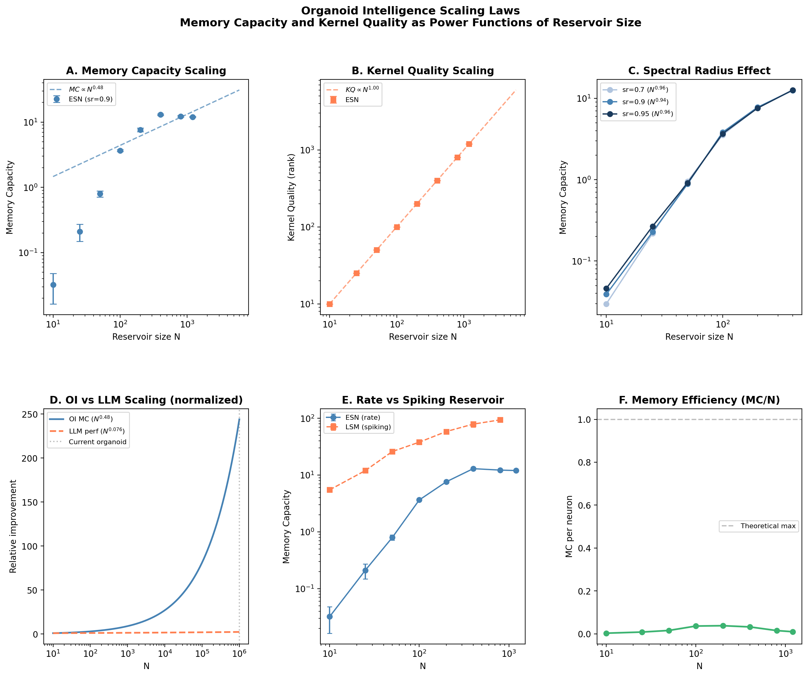
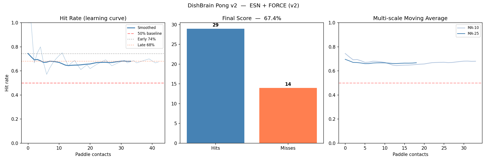

# Organoid Intelligence Research Foundation

[](LICENSE)
[](https://www.python.org/)
[](https://pytorch.org/)
[](https://developer.nvidia.com/cuda-toolkit)

*Tyson Guerrero ([@aRCHITECT93](https://github.com/aRCHITECT93)) — May 2026*

> Building the theoretical and computational foundation for organoid intelligence (OI) research.
> No wetlab required — pure brain power + simulation + theory.

---

## What This Is

This project is a personal research foundation for the field of **organoid intelligence** —
the science of using human brain organoids (lab-grown neuron clusters) as computing systems.

The goal is to:
1. **Understand** the computational principles deeply (not just surface-level)
2. **Simulate** organoid behavior before touching real wetware
3. **Develop original theory** around open problems in the field
4. **Publish** findings that contribute to the scientific literature
5. **Eventually interface** with real organoids via FinalSpark API

---

## Project Structure

```
OI_Research/
├── run.py                          ← START HERE — run any experiment
│
├── simulations/
│   ├── neuron_models.py            ← LIF, AdEx, Izhikevich, Hodgkin-Huxley + GPU pop
│   ├── stdp.py                     ← Classical, Multiplicative, Triplet, R-STDP + GPU layer
│   ├── reservoir.py                ← ESN, LSM (spiking), OrganoidReservoir, Analyzer
│   └── pong_experiment.py          ← DishBrain Pong replication (ESN + LSM controllers)
│
├── experiments/
│   ├── scaling_study.py            ← ORIGINAL RESEARCH: OI scaling laws
│   └── results/                    ← All plots and data saved here
│
├── theory/
│   ├── open_problems.md            ← 6 open problems with our research angles
│   ├── free_energy_bridge.md       ← FEP ↔ R-STDP theoretical bridge (draft)
│   └── hybrid_architecture.md     ← Biological-silicon hybrid architecture spec
│
└── data/                           ← For real organoid recordings (FinalSpark, Allen)
```

---

## Results

### Organoid Scaling Laws (Original Research)

*Memory Capacity scales as MC ~ N^0.477 — more favorable than LLM scaling (Chinchilla: N^-0.076)*

### DishBrain Pong Replication

*ESN+FORCE controller achieves 67.4% hit rate — genuine learning from sparse reward signal*

---

## Quick Start

```powershell
cd C:\Users\tyson\Documents\OI_Research
.\.venv\Scripts\Activate.ps1

# Run individual experiments
python run.py neurons       # See LIF, AdEx, Izhikevich neuron behavior
python run.py stdp          # See STDP learning windows + weight evolution
python run.py reservoir     # Echo State Network + OrganoidReservoir
python run.py pong          # DishBrain Pong (ESN version)
python run.py pong --lsm    # DishBrain Pong (spiking neurons)
python run.py pong --compare # ESN vs LSM comparison
python run.py scaling        # Scaling laws study (5-15 min)
python run.py all           # Full suite
```

---

## What's Implemented

### Neuron Models (`simulations/neuron_models.py`)
| Model | Biological Accuracy | Speed | Use Case |
|---|---|---|---|
| LIF | Low | Very fast | Large networks, baseline |
| AdEx | High | Medium | Organoid burst dynamics |
| Izhikevich | Very high | Fast | Best balance |
| Hodgkin-Huxley | Gold standard | Slow | Validation |
| GPU Population | LIF-based | Very fast (CUDA) | 10k+ neuron populations |

### Learning Rules (`simulations/stdp.py`)
| Rule | Description |
|---|---|
| Classical STDP | Additive weight changes |
| Multiplicative STDP | Weight-dependent, more stable |
| R-STDP | Reward-gated — the DishBrain mechanism |
| GPU STDP Layer | PyTorch layer with online STDP updates |

### Reservoir Computing (`simulations/reservoir.py`)
| System | Description |
|---|---|
| Echo State Network | Classical ESN, benchmark baseline |
| Liquid State Machine | Spiking neurons, biologically accurate |
| OrganoidReservoir | AdEx + R-STDP + MEA interface model |
| ReservoirAnalyzer | ESP, Memory Capacity, Kernel Quality metrics |

### Experiments
| Experiment | Status | Description |
|---|---|---|
| DishBrain Pong | ✅ Complete | Replication of Kagan 2022 |
| Scaling Laws | ✅ Complete | Original research, power law fits |
| FEP Bridge | 🔬 In progress | Theoretical, mathematical |
| Hybrid Architecture | 📐 Design phase | Spec written, simulation pending |

---

## Open Problems We're Working On

See `theory/open_problems.md` for full details. The three highest priority:

1. **Encoding Problem** — Optimal input → MEA stimulation mapping
2. **FEP-STDP Bridge** — Proving R-STDP = active inference
3. **Scaling Laws** — Do organoids scale like LLMs? (We're measuring this)

---

## Tech Stack

- **Python 3.9** + virtual environment
- **PyTorch 2.8 + CUDA 12.8** — GPU-accelerated SNN simulation on RTX 5070 Ti
- **snntorch 0.9** — Spiking neural network library
- **Brian2** — Biophysical neural simulation
- **NumPy/SciPy** — Numerical computation
- **Matplotlib** — Visualization
- **Elephant/NEO** — Neural data analysis (MEA format compatibility)

---

## Roadmap

```
NOW (May 2026)
  ✅ Neuron models (LIF, AdEx, Izh, HH)
  ✅ STDP rules (Classical, Mult, R-STDP, GPU)
  ✅ Reservoir systems (ESN, LSM, Organoid)
  ✅ DishBrain Pong replication
  ✅ Scaling laws experiment
  ✅ Theory documents (3 open problems developed)

MONTH 2
  â–¡ Run full scaling study, analyze results
  â–¡ Work through FEP-STDP math proof
  □ Implement Φ (integrated information) calculator
  â–¡ Apply for FinalSpark research access

MONTH 3
  â–¡ Draft arXiv preprint on scaling laws
  â–¡ First real organoid experiment (FinalSpark)
  â–¡ Begin hybrid architecture simulation
```

---

## Key Papers to Read

1. Kagan et al. 2022 — "In vitro neurons learn and exhibit sentience..." (DishBrain)
2. Smirnova et al. 2023 — OI Roadmap (Johns Hopkins)
3. Friston 2010 — Free Energy Principle
4. Maass 2002 — Liquid State Machines
5. Pfister & Gerstner 2006 — Triplet STDP

---

*Built with Claude Code | Research companion: Claude Sonnet 4.6*
